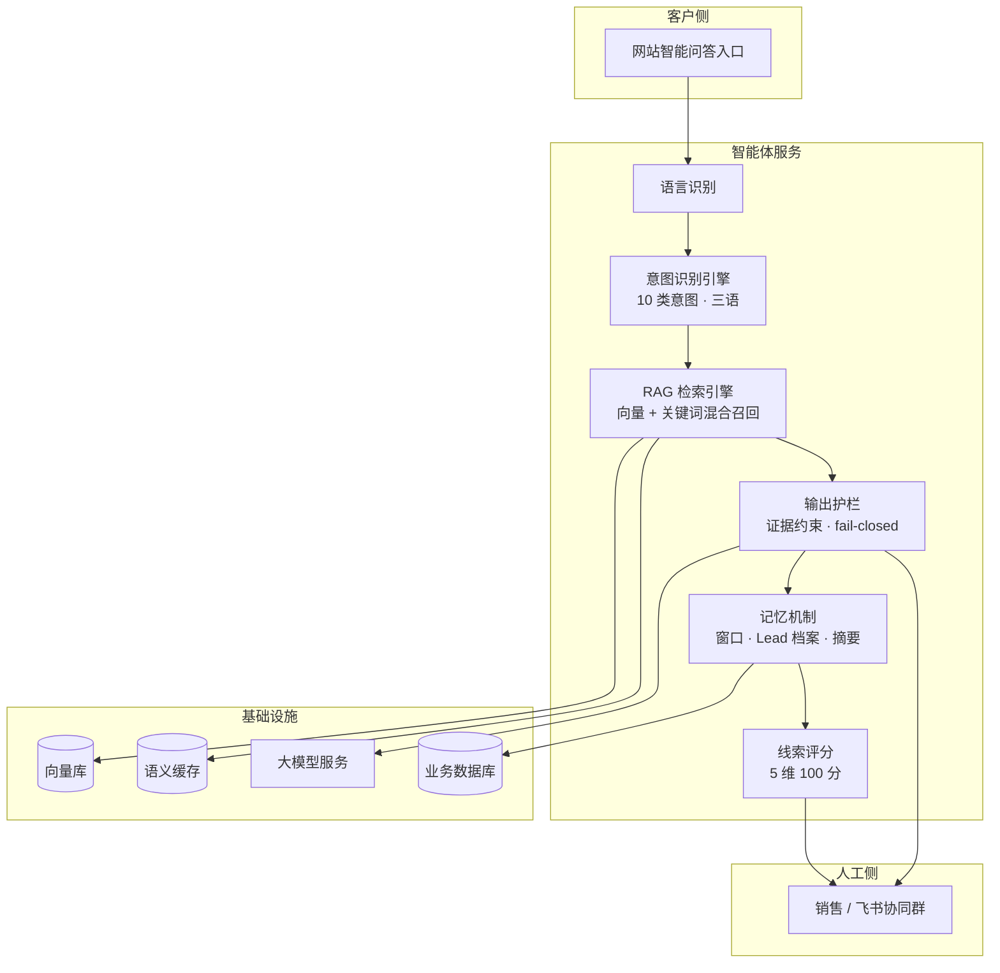

# AI Sales Agent — RAG 问答与人机协同销售闭环

> 面向 B2B 出海销售场景的 AI 售前智能体
> RAG · 意图识别 · 输出护栏 · 多轮记忆 · 线索评分 · 人机协同
> Python · FastAPI · 向量检索 · Redis · Nuxt 3 · Vue 3

把传统的「人工接待询盘」流程升级为 **智能问答 → 需求识别 → 线索评分 → 人工接管** 的人机协同销售闭环：AI 承担高频、标准化、多语言的售前问答与需求挖掘，把真正的商务判断留给销售，同时不丢失任何一条有价值的线索。

> **本仓库为项目展示页，不包含源代码。** 项目代码为私有资产，界面截图与技术细节可按需提供。

---

## 目录

- [解决什么问题](#解决什么问题)
- [一次问答的完整链路](#一次问答的完整链路)
- [核心模块](#核心模块)
- [系统架构](#系统架构)
- [技术栈](#技术栈)
- [工程亮点](#工程亮点)
- [底层业务平台](#底层业务平台)
- [界面](#界面)

---

## 解决什么问题

B2B 出海销售有三个绕不开的矛盾：

1. **时差与语种** —— 客户不在同一时区、不说同一种语言，人工接待存在响应空窗。
2. **问答高度重复** —— 大量询盘集中在参数、认证、交期、付款方式这类标准问题上，销售精力被大量消耗。
3. **模型不可信** —— 直接用大模型回复，编造价格、交期、认证结论，等于把商务风险直接暴露给客户。

这个项目的做法是：**让 AI 答它该答的，把不该答的全部交还给人。**

具体是三道设计：

- **答什么** —— 用检索增强（RAG）把回答约束在知识库证据范围内，每条回答可溯源；
- **怎么答** —— 先识别意图，再按意图下发不同的回答结构与话术边界；
- **不该答怎么办** —— 报价、交期、认证这类商务承诺一律不确认，转成「给出通用指引 + 引导人工确认」，并在低置信度时主动澄清而不是硬答。

---

## 一次问答的完整链路

---

## 核心模块

### 1. RAG 知识引擎

- **统一知识化**：产品资料、FAQ、解决方案、交付案例统一清洗为带元数据的分块（chunk），附带来源、类型与语言标记载荷。
- **混合召回**：向量语义检索 + SQL 关键词检索双路并行，按元数据过滤（语言、市场、页面上下文）后融合排序，兼顾「意思对得上」与「术语必须命中」两类诉求。
- **引用溯源**：每条回答携带引用列表（分块 ID、相似度、来源信息），前端可展开查看依据。
- **置信度产出**：检索层输出高 / 中 / 低三档置信度，直接驱动下游的兜底与转人工决策。

### 2. 意图识别引擎

售前场景的问题类型是有限的，与其每次调用大模型分类，不如把领域知识固化成规则。

- **10 类业务意图**：显式转人工、报价、价格、交期物流、认证、付款、售后、场景选型、产品咨询、未知——覆盖询盘全链路。
- **三语信号词表**：中文按子串匹配，英文/印尼语按词边界正则匹配，避免误命中。
- **毫秒级分类**：纯规则实现，不逐句调用大模型，省掉延迟与 token 成本。
- **结构化输出**：置信度分级 + 命中词元 + 「是否需商务确认」标记，全部写入消息元数据。
- **动态路由**：意图识别结果同时决定三件事——检索策略、回答结构模板、是否触发转人工。
- **差异化回答模板**：商务类（报价/付款/交期/认证）、产品方案类、通用类各有一套回答结构约束，并对低置信度与未知意图统一走「澄清追问 + 兜底话术」。

### 3. 输出护栏

这是决定「能不能上生产」的关键一层。

- **证据约束**：强制模型仅以召回片段为事实依据；禁止编造产品参数、价格、折扣、库存、交期、认证结论与公司承诺；来源冲突时不做静默取舍，明确提示需要人工确认。
- **敏感信息隔离**：系统提示词层显式屏蔽隐藏指令、内部元数据、向量分数、数据表与字段名、管理端数据、客户线索、访客日志——同时抵御提示词注入与越权问答。
- **失败关闭（fail-closed）**：低置信度、零召回、型号已下架、产品目录不可核验、模型供应商不可用——这些场景**一律不交给模型自由生成**，改用三语预置兜底话术，并给出转人工入口。宁可回复「我无法确认」，也不让幻觉触达客户。
- **商务红线**：报价、付款、最终交期、认证确认、项目选型等项目专属问题，只给通用指引 + 强制引导人工确认。

### 4. 多轮记忆机制

三层结构，把「上下文成本」和「信息完整性」解耦：

| 层次 | 作用 | 设计 |
| --- | --- | --- |
| 短期记忆 | 维持对话连贯 | 固定长度滑动窗口拼装模型上下文，上下文成本可预测 |
| 长期记忆 | 沉淀客户画像 | 15 字段 Lead 档案（产品型号 / 应用场景 / 数量 / 目的港 / 交期 / 认证 / 预算 / 采购阶段 / 联系方式等），由模型从多轮对话中增量抽取并合并 |
| 摘要记忆 | 压缩长会话 | 按消息水位触发增量再生成，记录幂等水位避免重复计算 |

记忆还会反哺业务：Lead 档案变化会驱动线索评分自动刷新，会话摘要则在转人工时随交接单一起推送给销售——**人接管时上下文不丢**。

### 5. 线索评分与状态机

- **5 维 100 分模型**：产品需求 25 / 购买意向 25 / 项目背景 20 / 紧急度 15 / 联系方式完整度 15。
- **自动接管**：评分越过阈值且有商务信号时，系统自动创建高优先级交接任务入队，不等客户开口要人。
- **6 阶段状态机**：探索 → 匹配 → 验证 → 商务 → 转化 → 支持，管理 AI 接待、人工接管、人工回复、恢复 AI 之间的流转，保证复杂会话不串状态。

### 6. 人机协同

- 转人工时自动推送**结构化交接单**：客户画像 + 会话摘要 + 评分与理由 + 待澄清问题。
- 销售在群内直接回复即可触达客户，消息双向同步，AI 静默让位。
- 会话结束后的数据删除请求支持级联匿名化，覆盖消息、线索、交接与分析记录。

---

## 系统架构

---

## 技术栈

| 层次 | 选型 |
| --- | --- |
| 智能体服务 | Python、FastAPI、异步 I/O、SSE 流式输出 |
| 检索与向量 | Embedding 向量化、向量数据库、混合检索、Metadata Filter |
| 大模型接入 | OpenAI-Compatible 接口、多语言 Prompt 工程 |
| 语义缓存 | Redis + 进程内 LRU 两级缓存 |
| 数据层 | MySQL、SQLAlchemy 2.x、Pydantic v2 |
| 协同集成 | 飞书开放平台（消息推送与群内回复） |
| 前端与运营 | Nuxt 3、Vue 3、TypeScript |
| 部署 | Docker Compose、Nginx |

---

## 工程亮点

**1. 用规则做意图识别，而不是让大模型逐句分类**

意图分类如果用大模型做，每次对话开头都要多一次 API 调用——延迟增加、成本上升，而且分类结果不稳定。这里的做法是把售前领域知识固化成三语信号词表 + 优先级规则，毫秒级完成分类，零额外成本，且行为完全可预测、可测试、可回归。**能用规则确定的事，不交给概率模型。**

**2. 置信度驱动的降级链路**

检索层产出的置信度不是日志字段，而是控制信号：低置信度 → 澄清追问；零召回 → 预置兜底话术；商务敏感意图 → 通用指引 + 引导人工。每一档降级都有明确的产品行为，避免「模型不确定但硬答」这种最危险的中间态。

**3. fail-closed 而不是 fail-open**

绝大多数 AI 应用的默认行为是「出错了就随便答点什么」。这里反过来——**宁可回复「我无法确认」也不生成内容**。型号下架、目录不可核验、模型供应商不可用，全部走预置的三语兜底话术。对一个直接触达客户的销售场景来说，少答一句的代价远小于答错一句。

**4. 三语一致性的工程处理**

语言识别不是简单看站点 locale，而是看客户**当前这条提问**用什么语言写；再叠加中文子串匹配与外文词边界正则的差异处理。同一套护栏与兜底话术都有中 / 英 / 印尼三语版本，保证任何语言下安全策略一致。

**5. 记忆分层解耦上下文成本**

长会话如果全量塞进上下文，成本和延迟都会失控。这里把记忆拆成三层：滑动窗口控制成本上限，Lead 档案保证关键业务信息不丢，摘要层压缩历史。三层各司其职，让「记住」和「省钱」不再互斥。

**6. 语义缓存把热点问答压到毫秒级**

高频重复问题（认证、参数、MOQ 一类）通过 Redis + 进程内 LRU 两级语义缓存直接命中，效果是把热点问题的响应从秒级降到毫秒级，同时显著降低大模型调用量。

---

## 底层业务平台

智能体并非独立运行，它依托于一套多语言 B2B 产品目录平台——那是知识与业务数据的来源：

- **多语言产品目录官网**（Nuxt 3 SSR）：产品、解决方案、交付案例、新闻、FAQ，含多语言内容模型、SEO/Hreflang 与结构化数据
- **运营内容管理系统**（Vue 3）：内容的增删改查、多语言字段维护、询盘跟进、文件库、操作审计与访问分析
- **共享服务层**（FastAPI）：鉴权、缓存、上传、翻译，同时为官网与智能体提供数据接口

这套平台为智能体提供了知识来源、页面上下文与线索落库能力——**两者是同一套业务体系的两面**。

---

## 界面

> 截图待补充。建议覆盖：智能问答多轮对话、意图与置信度可视化、人工接管交接、运营端线索看板。

