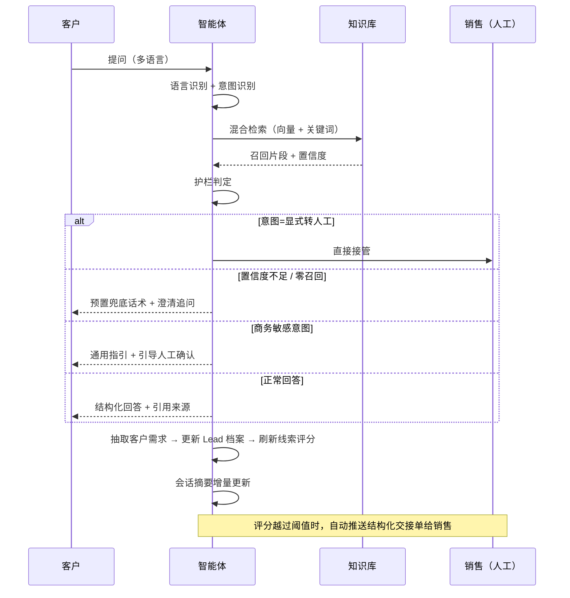
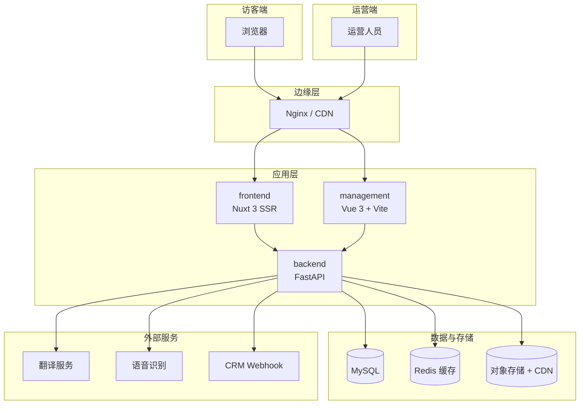

# AI Sales Agent Platform

> 面向 B2B 出海销售的 AI 售前智能体及其底层多语言内容平台
> RAG · 意图识别 · 输出护栏 · 多轮记忆 · 线索评分 · 人机协同
> Python · FastAPI · Nuxt 3 · Vue 3 · MySQL · Redis · Docker

把传统的「人工接待询盘」升级为 **智能问答 → 需求识别 → 线索评分 → 人工接管** 的人机协同销售闭环：AI 承担高频、标准化、多语言的售前问答与需求挖掘，把真正的商务判断留给销售，同时不丢失任何一条有价值的线索。

---

## 目录

- [解决什么问题](#解决什么问题)
- [本仓库包含什么](#本仓库包含什么)
- [智能体核心设计](#智能体核心设计)
- [一次问答的完整链路](#一次问答的完整链路)
- [底层业务平台](#底层业务平台)
- [系统架构](#系统架构)
- [技术栈](#技术栈)
- [代码结构](#代码结构)
- [本地运行](#本地运行)
- [许可](#许可)

---

## 解决什么问题

B2B 出海销售有三个绕不开的矛盾：

1. **时差与语种** —— 客户不在同一时区、不说同一种语言，人工接待存在响应空窗。
2. **问答高度重复** —— 大量询盘集中在参数、认证、交期、付款方式这类标准问题上，销售精力被大量消耗。
3. **模型不可信** —— 直接用大模型回复，编造价格、交期、认证结论，等于把商务风险直接暴露给客户。

这个项目的做法是：**让 AI 答它该答的，把不该答的全部交还给人。**

- **答什么** —— 用检索增强（RAG）把回答约束在知识库证据范围内，每条回答可溯源；
- **怎么答** —— 先识别意图，再按意图下发不同的回答结构与话术边界；
- **不该答怎么办** —— 报价、交期、认证这类商务承诺一律不确认，转成「给出通用指引 + 引导人工确认」，并在低置信度时主动澄清而不是硬答。

## 智能体核心设计

以下为智能体的设计说明（实现未包含在本仓库中）。

### 1. RAG 知识引擎

- **统一知识化**：产品资料、FAQ、解决方案、交付案例统一清洗为带元数据的分块，附带来源、类型与语言标记载荷。
- **混合召回**：向量语义检索 + SQL 关键词检索双路并行，按元数据过滤（语言、市场、页面上下文）后融合排序，兼顾「意思对得上」与「术语必须命中」两类诉求。
- **引用溯源**：每条回答携带引用列表（分块 ID、相似度、来源信息），前端可展开查看依据。
- **置信度产出**：检索层输出高 / 中 / 低三档置信度，直接驱动下游的兜底与转人工决策。

### 2. 意图识别引擎

售前场景的问题类型是有限的，与其每次调用大模型分类，不如把领域知识固化成规则。

- **10 类业务意图**：显式转人工、报价、价格、交期物流、认证、付款、售后、场景选型、产品咨询、未知——覆盖询盘全链路。
- **三语信号词表**：中文按子串匹配，英文/其他语种按词边界正则匹配，避免误命中。
- **毫秒级分类**：纯规则实现，不逐句调用大模型，省掉延迟与 token 成本。
- **结构化输出**：置信度分级 + 命中词元 + 「是否需商务确认」标记，全部写入消息元数据。
- **动态路由**：意图识别结果同时决定三件事——检索策略、回答结构模板、是否触发转人工。
- **差异化回答模板**：商务类（报价/付款/交期/认证）、产品方案类、通用类各有一套回答结构约束。

### 3. 输出护栏

这是决定「能不能上生产」的关键一层。

- **证据约束**：强制模型仅以召回片段为事实依据；禁止编造产品参数、价格、折扣、库存、交期、认证结论与公司承诺；来源冲突时不做静默取舍，明确提示需要人工确认。
- **敏感信息隔离**：系统提示词层显式屏蔽隐藏指令、内部元数据、向量分数、数据表与字段名、管理端数据、客户线索、访客日志——同时抵御提示词注入与越权问答。
- **失败关闭（fail-closed）**：低置信度、零召回、型号已下架、产品目录不可核验、模型供应商不可用——这些场景**一律不交给模型自由生成**，改用三语预置兜底话术，并给出转人工入口。宁可回复「我无法确认」，也不让幻觉触达客户。
- **商务红线**：报价、付款、最终交期、认证确认、项目选型等项目专属问题，只给通用指引 + 强制引导人工确认。

### 4. 多轮记忆机制

三层结构，把「上下文成本」和「信息完整性」解耦：

| 层次 | 作用 | 设计 |
| --- | --- | --- |
| 短期记忆 | 维持对话连贯 | 固定长度滑动窗口拼装模型上下文，上下文成本可预测 |
| 长期记忆 | 沉淀客户画像 | 15 字段 Lead 档案（产品型号 / 应用场景 / 数量 / 目的港 / 交期 / 认证 / 预算 / 采购阶段 / 联系方式等），由模型从多轮对话中增量抽取并合并 |
| 摘要记忆 | 压缩长会话 | 按消息水位触发增量再生成，记录幂等水位避免重复计算 |

记忆还会反哺业务：Lead 档案变化会驱动线索评分自动刷新，会话摘要则在转人工时随交接单一起推送给销售——**人接管时上下文不丢**。

### 5. 线索评分与状态机

- **5 维 100 分模型**：产品需求 25 / 购买意向 25 / 项目背景 20 / 紧急度 15 / 联系方式完整度 15。
- **自动接管**：评分越过阈值且有商务信号时，系统自动创建高优先级交接任务入队，不等客户开口要人。
- **6 阶段状态机**：探索 → 匹配 → 验证 → 商务 → 转化 → 支持，管理 AI 接待、人工接管、人工回复、恢复 AI 之间的流转。

### 6. 人机协同

- 转人工时自动推送**结构化交接单**：客户画像 + 会话摘要 + 评分与理由 + 待澄清问题。
- 销售在群内直接回复即可触达客户，消息双向同步，AI 静默让位。
- 会话结束后的数据删除请求支持级联匿名化，覆盖消息、线索、交接与分析记录。

---

## 一次问答的完整链路



---

## 底层业务平台

智能体并非独立运行，它依托于本仓库中的这套多语言 B2B 平台——那是知识来源、页面上下文与线索落库的底座。

**访客侧**

- 多语言产品目录：分类导航、筛选、分页、搜索、关联产品推荐
- 产品详情：结构化规格表、价格梯度、多图相册、技术参数分组
- 解决方案 / 交付案例 / 新闻资讯 的内容展示与详情页
- FAQ 分类浏览、关于我们、联系我们、隐私政策
- 多商品合并询盘：一次提交多个意向产品，支持附件上传
- 语音询盘：文件转写与实时语音识别两种入口

**运营侧**

- 目录管理：分类、产品、解决方案、新闻、交付案例的增删改查与批量启停
- 结构化内容编辑：规格矩阵、价格梯度、亮点、交付流程、服务保障等分块编辑器
- 多语言内容维护：同一实体的多语言字段并排编辑，支持批量翻译生成
- 站点配置、素材文件库、询盘跟进、操作审计与访问分析

**平台侧**

- 响应缓存：公开 JSON 接口的 Redis 多级缓存与精确失效
- SEO 工程：sitemap 索引与分片、hreflang、canonical、结构化数据、`llms.txt`
- 资源分发：对象存储 + CDN 资源地址，支持 WebP 与尺寸自适应
- 多端鉴权：管理台 JWT 鉴权、写操作审计、密码 PBKDF2-SHA256

---

## 系统架构



---

## 技术栈

| 层次 | 选型 |
| --- | --- |
| 前端框架 | Nuxt 3、Vue 3（Composition API）、TypeScript |
| 构建工具 | Vite、Nitro |
| 后端框架 | FastAPI、Pydantic v2、SQLAlchemy 2.x |
| 数据库 | MySQL（生产）/ SQLite（本地测试） |
| 缓存 | Redis（响应缓存 + 缓存族版本号失效） |
| 对象存储 | 腾讯云 COS + CDN |
| 鉴权 | JWT（HS256）+ PBKDF2-SHA256 密码哈希 |
| 部署 | Docker Compose、Nginx |
| 内容安全 | nh3 富文本白名单清洗 |
| 多语言 | 自建 i18n 层，支持 `id` / `en` / `zh-cn` 三种语言段 |
| 可观测 | 请求 ID 透传、操作审计日志、Web Vitals 上报 |

---

## 代码结构

```text
.
├── backend/                          # FastAPI 服务层
│   ├── app/main.py                   # 应用入口与路由注册
│   ├── app/core/                     # 配置、数据库连接、鉴权
│   ├── app/models/                   # SQLAlchemy 实体
│   ├── app/routers/                  # 公开 API 与管理 API
│   ├── app/schemas/                  # Pydantic 请求/响应契约
│   ├── app/services/                 # 缓存、翻译、文件、内容清洗等服务
│   ├── app/middleware/               # 响应缓存与请求 ID 中间件
│   └── tests/                        # 后端测试
├── frontend/                         # Nuxt 3 公共网站（SSR + SEO）
│   └── src/
│       ├── pages/                    # 多语言路由页面
│       ├── views/                    # 页面视图组件
│       ├── components/               # 通用与业务组件
│       ├── composables/              # i18n、SEO、目录等组合式逻辑
│       ├── server/                   # Nitro 服务端路由（sitemap / revalidate / 代理）
│       └── data/                     # 演示内容数据
├── management/                       # Vue 3 + Vite 运营管理台
│   └── src/
│       ├── views/                    # 管理页面
│       ├── components/               # 目录、文件、询盘、分析等组件
│       ├── stores/                   # Pinia 状态
│       └── router/                   # 管理台路由
├── docker-compose.yml                # 服务编排
└── .env.production.example           # 环境变量示例
```

---

## 本地运行

前置条件：Python 3.12、Node.js 22+、npm；MySQL、Redis、COS 和外部服务按需配置。

```bash
python3.12 -m venv .venv
.venv/bin/pip install -r backend/requirements.txt
cd frontend && npm ci
cd ../management && npm ci
cd ..
export DATABASE_URL="sqlite:///$(pwd)/backend/examplecorp.db"
```

分别打开三个终端：

```bash
# Backend: http://127.0.0.1:8000
PYTHONPATH=backend .venv/bin/uvicorn app.main:app \
  --reload --host 127.0.0.1 --port 8000
```

```bash
# Public website: http://127.0.0.1:5173
cd frontend && npm run dev
```

```bash
# Management console: http://127.0.0.1:5174
cd management && npm run dev
```

FastAPI 文档：<http://127.0.0.1:8000/docs>；健康检查：<http://127.0.0.1:8000/api/health>。

后端启动时会创建或兼容数据库表，并确保默认管理员用户存在。生产环境必须修改 `ADMIN_DEFAULT_PASSWORD` 和 `AUTH_SECRET_KEY`。

### 测试与构建

```bash
PYTHONPATH=backend .venv/bin/pytest -q
node --test frontend/src/**/*.test.mjs
cd frontend && npm run typecheck && npm run build
cd ../management && npm run build
```

---

## 许可

本项目为专有软件，**All Rights Reserved**。未经版权所有者书面许可，不得复制、修改、分发或用于任何商业用途。

详见 [LICENSE](./LICENSE)。
